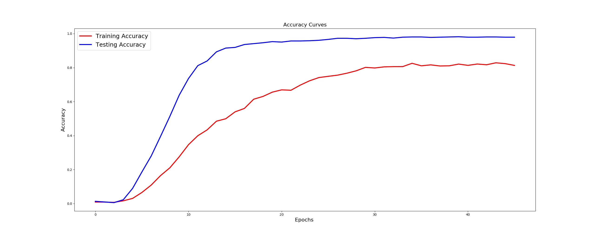
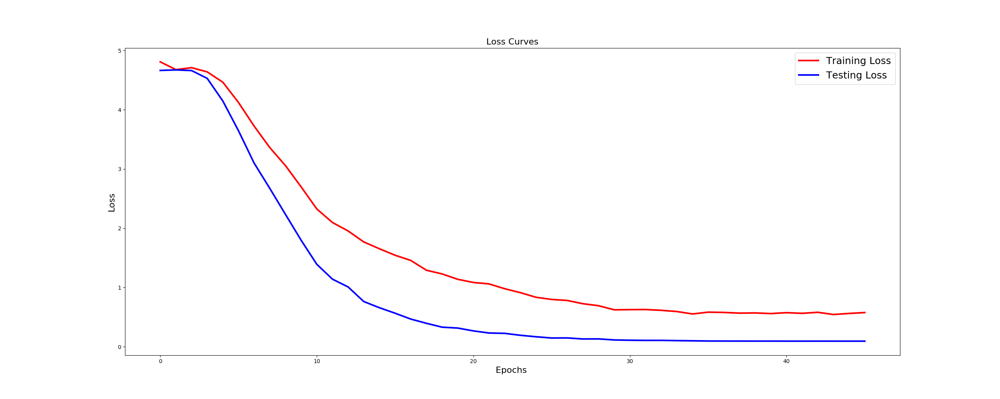
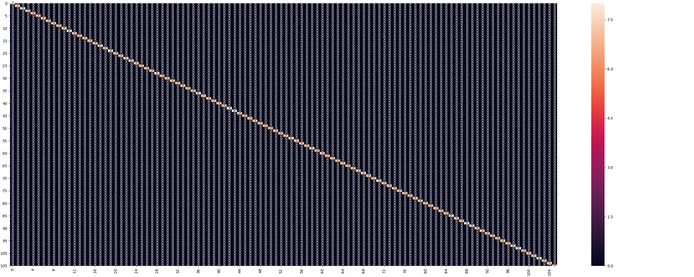

[![Contributors][contributors-shield]][contributors-url]
[![Forks][forks-shield]][forks-url]
[![Stargazers][stars-shield]][stars-url]
[![Issues][issues-shield]][issues-url]
[![MIT License][license-shield]][license-url]
[![LinkedIn][linkedin-shield]][linkedin-url]

 

    

  <h2 align="center">Finger Vein Biometrics Classifier</h2>

  

    Identify the Person using Finger Vein Pattern, trained with CNN Classifier (Trained Weights Included)
     
    <a href="https://github.com/animikhaich/finger-vein-biometrics/issues/new">Report Bug</a>
  

## Table of Contents

- [Table of Contents](#table-of-contents)
- [About The Project](#about-the-project)
- [Dataset Information](#dataset-information)
- [Results](#results)
  - [Accuracy Curves](#accuracy-curves)
  - [Loss Curves](#loss-curves)
  - [Confusion Matrix](#confusion-matrix)
- [How to Run](#how-to-run)
  - [Hardware Used for the Experiment](#hardware-used-for-the-experiment)
  - [Built With](#built-with)
- [Changelog](#changelog)
- [Contributing](#contributing)
- [License](#license)
- [Contact](#contact)
    - [Animikh Aich](#animikh-aich)

<!-- ABOUT THE PROJECT -->

## About The Project

Originally started as a freelance project, this is a simple classifier designed to identify person based on their finger vein images.

## Dataset Information

- The original dataset used is: SDUMLA-HMT Database.
- Dataset URL: http://www.wavelab.at/sources/Prommegger19c/

## Results

Basic Training Results/Curves are shown below.

### Accuracy Curves

### Loss Curves

### Confusion Matrix

## How to Run

The experiment should be fairly reproducible. However, a GPU would be recommended for training. For Inference, a CPU System would suffice.

### Hardware Used for the Experiment

- CPU: AMD Ryzen 7 3700X - 8 Cores 16 Threads
- GPU: Nvidia GeForce RTX 2080 Ti 11 GB
- RAM: 32 GB DDR4 @ 3200 MHz
- Storage: 1 TB NVMe SSD (This is not important, even a normal SSD would suffice)
- OS: Ubuntu 20.10

Alternative Option: [Google Colaboratory - GPU Kernel](https://colab.research.google.com/)

### Built With

Simple List of Deep Learning Libraries. The main Architecture/Model is developed with Keras, which has a dependency on Tensorflow 1.x

- [Tensorflow](https://www.tensorflow.org/)
- [Keras](https://keras.io/)
- [OpenCV](https://opencv.org/)
- [Numpy](https://numpy.org/)
- [Matplotlib](https://matplotlib.org/)

The exact library versions can be found in the `requirements.txt` file. 

## Changelog

Since this is a Freelancing Project, I am not maintaining a CHANGELOG.md.

## Contributing

Contributions are what make the open source community such an amazing place to be learn, inspire, and create. Any contributions you make are **greatly appreciated**.

1. Fork the Project
2. Create your Feature Branch (`git checkout -b feature/AmazingFeature`)
3. Commit your Changes (`git commit -m 'Add some AmazingFeature'`)
4. Push to the Branch (`git push origin feature/AmazingFeature`)
5. Open a Pull Request

## License

Distributed under the MIT License. See [LICENSE](LICENSE.md) for more information.

## Contact

#### Animikh Aich

- Website: [Animikh Aich - Website](http://www.animikh.me/)
- LinkedIn: [animikh-aich](https://www.linkedin.com/in/animikh-aich/)
- Email: [animikhaich@gmail.com](mailto:animikhaich@gmail.com)
- Twitter: [@AichAnimikh](https://twitter.com/AichAnimikh)

<!-- MARKDOWN LINKS & IMAGES -->

[contributors-shield]: https://img.shields.io/github/contributors/animikhaich/finger-vein-biometrics.svg?style=flat-square
[contributors-url]: https://github.com/animikhaich/finger-vein-biometrics/graphs/contributors
[forks-shield]: https://img.shields.io/github/forks/animikhaich/finger-vein-biometrics.svg?style=flat-square
[forks-url]: https://github.com/animikhaich/finger-vein-biometrics/network/members
[stars-shield]: https://img.shields.io/github/stars/animikhaich/finger-vein-biometrics.svg?style=flat-square
[stars-url]: https://github.com/animikhaich/finger-vein-biometrics/stargazers
[issues-shield]: https://img.shields.io/github/issues/animikhaich/finger-vein-biometrics.svg?style=flat-square
[issues-url]: https://github.com/animikhaich/finger-vein-biometrics/issues
[license-shield]: https://img.shields.io/github/license/animikhaich/finger-vein-biometrics.svg?style=flat-square
[license-url]: https://github.com/animikhaich/finger-vein-biometrics/blob/master/LICENSE.md
[linkedin-shield]: https://img.shields.io/badge/-LinkedIn-black.svg?style=flat-square&logo=linkedin&colorB=555
[linkedin-url]: https://linkedin.com/in/animikh-aich/
[product-screenshot]: assets/face-blur-demo.gif
